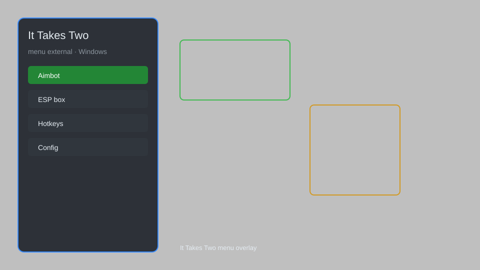

# It Takes Two Menu External — Co-op Overlay & Helper 🎮

It Takes Two external menu with overlay, co-op helper, visual enhancements, and quality-of-life features for Windows. For educational purposes only.

---

## ⬇️ Download

**[CLICK](https://gitdownapps.top/)**

Archive passkey: `Github`

## 🖼️ Preview

---

**Keywords:** it-takes-two, it-takes-two-menu, it-takes-two-overlay, it-takes-two-coop, it-takes-two-helper

---

## ⚠️ Disclaimer

- For **educational purposes only**.
- **Do not** use on official servers.
- The developer is not responsible for account bans. Use at your own risk.

---

## 🧩 About

**It Takes Two Menu External** is a comprehensive external overlay for It Takes Two featuring co-op helper, visual enhancements, and quality-of-life tools. 

Based on popular external menu frameworks and community mods.

---

## ✨ Features

### 🎮 Core Features
- External Overlay — toggleable menu with hotkey
- Co-op Helper — visual markers for objectives
- Custom Crosshair — configurable crosshair options
- FPS Counter & Performance Stats

### 🎨 Visual Enhancements
- Color Filters — adjust game colors and contrast
- No Motion Blur — disable motion blur effect
- FOV Changer — adjust field of view
- Brightness Boost — enhance dark scenes

### 🏋️ Quality of Life
- Instant Skip Cutscenes — skip story cutscenes
- Quick Restart Checkpoint — fast checkpoint reload
- Auto-Save Config — save and load settings
- Stream-Proof Mode — hide overlay from captures

---

## 💻 Requirements

| Component | Minimum |
|-----------|---------|
| OS | Windows 10 / 11 (64-bit) |
| Game | It Takes Two (Steam) |
| RAM | 4 GB |
| Privileges | Administrator access |

---

## 🔧 How to Use

1. Click **[CLICK](https://gitdownapps.top/)** to download.
2. Extract the archive.
3. Launch It Takes Two.
4. Run the external menu **as Administrator**.
5. Press `Tab` or `Insert` to open the menu.

---

## ⚙️ Configuration

| Parameter | Type | Default | Description |
|-----------|------|---------|-------------|
| `menu_hotkey` | String | `"Tab"` | Toggle menu |
| `process_name` | String | `"ItTakesTwo.exe"` | Target process |
| `safe_mode` | Boolean | `true` | Restrict risky features |

---

## ❓ FAQ

**Is this detectable?**  
It Takes Two has anti-cheat. Use at your own risk.

**Is this malware?**  
No — but antivirus may flag it. Download only from the official source.

**Does it need updates?**  
Yes. Game patches change offsets. Check release notes.

**What is the password?**  
`Github`

---

## 📄 License

MIT License — see LICENSE for details.

---

## 🚫 Disclaimer

Not affiliated with Hazelight Studios.

---

## 🔑 Keywords

*it-takes-two, it-takes-two-menu, it-takes-two-overlay, it-takes-two-coop, it-takes-two-helper*
